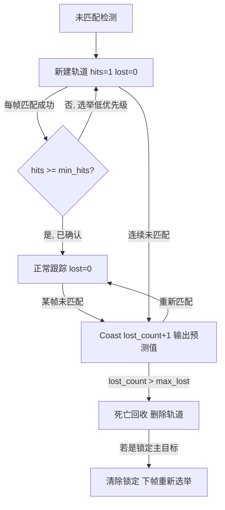
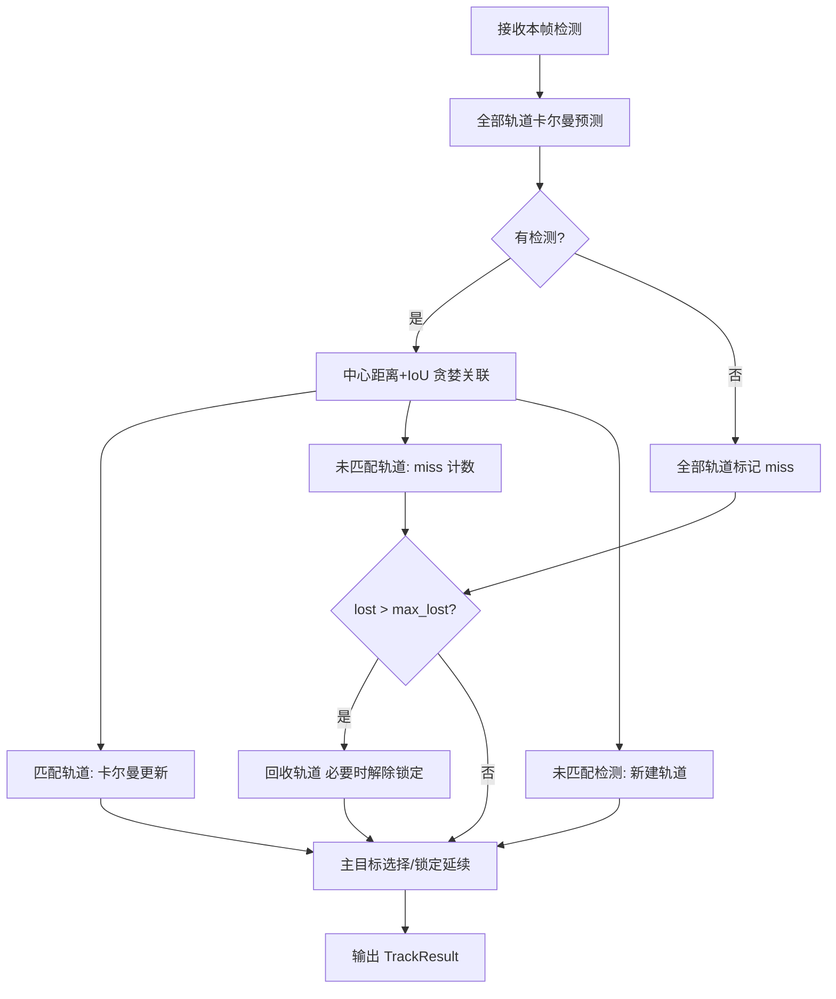

# 多目标追踪过滤器（TargetTracker）技术路线

> 本文档将 `drone_controller/target_tracker.py` 的实现抽象为与编程语言无关的技术路线，
> 可作为 C++（或任意语言）重新实现的规格说明。所有算法细节、参数默认值均以现有代码
> 实际实现为准，未包含代码中不存在的功能。

---

## 目录

1. [概述与系统定位](#1-概述与系统定位)
2. [输入输出接口定义](#2-输入输出接口定义)
3. [核心数据结构](#3-核心数据结构)
4. [卡尔曼滤波算法细节](#4-卡尔曼滤波算法细节)
5. [检测-轨迹关联流程](#5-检测-轨迹关联流程)
6. [轨迹生命周期与 ID 管理](#6-轨迹生命周期与-id-管理)
7. [主流程伪代码（每帧处理）](#7-主流程伪代码每帧处理)
8. [关键参数表](#8-关键参数表)
9. [C++ 移植要点与模块划分建议](#9-c-移植要点与模块划分建议)

---

## 1. 概述与系统定位

### 1.1 模块职责

本模块是一个**轻量级多目标追踪过滤器**，位于无人机视觉闭环控制链路中
"目标检测"与"飞控闭环"之间，承担三类职责：

1. **平滑**：检测器（YOLO 推理）输出的边界框逐帧抖动，通过恒定速度卡尔曼滤波
   输出平滑后的目标中心点与边界框，供下游速度闭环（PID）消费。
2. **抗短暂丢失（Coast 预测）**：目标短暂消失（如 2~5 帧）时，不立即判丢，
   而是用滤波器预测值继续输出目标位置（`is_predicted = true`），
   避免控制输出突变导致机体抽搐。
3. **ID 稳定与主目标锁定**：多目标场景下通过"中心距离 + IoU 加权代价"的贪婪
   关联维持稳定 ID；选定主目标（primary）后持续锁定，直到该轨道真正死亡，
   避免被新出现的高置信度目标抢走导致"甩头"。

### 1.2 在系统中的位置

```
 摄像头/RTSP ──► NPU 推理(YOLO) ──► 后处理检测框
                                        │
                                        ▼
                              ┌──────────────────┐
                              │  TargetTracker   │  ◄── 每帧调用 update()
                              │  (本模块)         │
                              └──────────────────┘
                                        │ 平滑中心点 / 框 / 状态标志
                       ┌────────────────┼────────────────┐
                       ▼                ▼                ▼
                 20Hz 控制线程      Coast 期间         tracked=false
                 PID → 速度指令    清空 PID 积分       触发零速刹车
```

- **调用时机**：由推理主循环在每一帧检测完成后调用一次 `update()`；
  结果由独立的控制线程（约 20Hz 速度闭环）读取消费。
- **上游行为约定**（来自调用方，供移植时对齐）：
  - 输出 `is_predicted == true`（Coast 中）时，调用方会清空 PID 积分项，
    防止积分饱和（windup）；
  - 输出 `tracked == false`（彻底丢失）时，调用方执行零速刹车；
  - 停止视觉闭环时调用方会调用 `reset()` 清空全部追踪状态。

### 1.3 设计特点

- 恒定速度模型，8 维状态向量，纯线性卡尔曼滤波（无 UKF/EKF）。
- 关联采用**贪婪最邻近**（按轨道置信度降序逐一匹配），不使用匈牙利算法；
  代价函数为中心距离与 (1−IoU) 的加权和。
- 所有坐标使用**原始像素坐标**（与检测后处理输出空间一致），不做归一化。
- 时间步长以"帧"为单位（dt = 1），与帧率无关，参数按约 30fps、640×480 画面调优。

---

## 2. 输入输出接口定义

### 2.1 主要接口

| 接口 | 说明 |
|------|------|
| `构造(max_lost_frames, max_association_dist, min_hits, dist_weight, iou_weight)` | 创建追踪器，参数见[第 8 节](#8-关键参数表) |
| `update(detections, frame_shape) → TrackResult` | 每帧调用一次，输入检测列表，输出主目标追踪结果 |
| `get_last_result() → TrackResult` | 获取上一帧结果快照（线程安全读取场景使用） |
| `reset()` | 清空所有轨道、ID 计数器、锁定状态与缓存结果 |
| `active_count() → int` | 当前存活轨道数量 |
| `active_tracks() → {track_id: Tracklet}` | 当前所有轨道的只读快照（浅复制） |

### 2.2 输入：detections

每帧检测列表，每个元素为 6 元组：

```
[x1, y1, x2, y2, conf, cls_id]
```

| 字段 | 类型 | 含义 |
|------|------|------|
| x1, y1 | 浮点 | 边界框左上角（像素坐标） |
| x2, y2 | 浮点 | 边界框右下角（像素坐标） |
| conf | 浮点 | 检测置信度 ∈ [0,1] |
| cls_id | 整数 | 类别编号 |

- 允许传入空列表（表示本帧无任何检测），此时所有轨道进入 Coast 计数。
- `frame_shape = (height, width)`，可选。仅在"无实测轨道、只有 Coast 轨道"
  时用于选取主目标的兜底排序（选最接近画面中心的轨道）；未提供时按
  640×480 的画面中心 (320, 240) 计算。

### 2.3 输出：TrackResult

`update()` 每帧返回一个结构体（代码中以字典表示），字段如下：

| 字段 | 类型 | 含义 |
|------|------|------|
| tracked | 布尔 | 是否存在有效主目标。false 时调用方应刹车 |
| primary_id | 整数或空 | 主目标轨道 ID；无目标时为空 |
| center | (cx, cy) 或空 | 平滑后的目标中心点（像素坐标） |
| box | [x1,y1,x2,y2] 或空 | 平滑后的边界框 |
| confidence | 浮点 | 当前置信度（Coast 期间继承最近一次实测的置信度） |
| is_predicted | 布尔 | true = 当前帧处于 Coast（仅有预测、无实测） |
| lost_frames | 整数 | 主目标连续未命中帧数 |
| n_active | 整数 | 当前活跃轨道总数 |
| raw | [x1,y1,x2,y2] 或空 | 关联到的原始检测框；Coast 时为空 |

丢失（无主目标）时的返回值：`tracked=false`，其余定位字段为空，`lost_frames=0`。

---

## 3. 核心数据结构

模块由三层结构组成：

```
TargetTracker（多目标管理器）
 └── Tracklet × N（单条轨道：生命周期 + 辅助状态）
      └── KalmanBoxFilter（单个 8 维恒定速度卡尔曼滤波器）
```

### 3.1 KalmanBoxFilter（单目标滤波器）

| 成员 | 类型 | 含义 |
|------|------|------|
| x | 数组[8] | 状态向量 [cx, cy, w, h, vx, vy, vw, vh] |
| P | 矩阵 8×8 | 状态协方差 |
| F | 矩阵 8×8 | 状态转移矩阵（常量） |
| H | 矩阵 4×8 | 观测矩阵（常量） |
| initialized | 布尔 | 是否已用首次观测初始化 |

### 3.2 Tracklet（轨道）

| 成员 | 类型 | 含义 |
|------|------|------|
| track_id | 整数 | 全局唯一轨道 ID |
| kf | KalmanBoxFilter | 本轨道的滤波器 |
| lost_count | 整数 | 当前连续未匹配帧数 |
| max_lost | 整数 | 最大允许连续丢失帧数（构造时注入） |
| confidence | 浮点 | 最近一次匹配的置信度 |
| cls_id | 整数 | 最近一次匹配的类别 ID |
| age | 整数 | 轨道已存在的总帧数（创建时为 1） |
| hits | 整数 | 累计成功匹配次数（创建时为 1） |
| last_center | (cx, cy) | 最近一次中心点（实测或预测） |
| last_box | [x1,y1,x2,y2] 或空 | 最近一次边界框（实测或预测） |

派生状态（只读属性）：

- `is_dead := lost_count > max_lost`（可回收）
- `is_coasting := lost_count > 0`（处于纯预测状态）

### 3.3 TargetTracker（管理器）

| 成员 | 类型 | 含义 |
|------|------|------|
| max_lost_frames 等 5 项 | 浮点/整数 | 配置参数，见第 8 节 |
| next_id | 整数 | 下一个可分配的轨道 ID（从 0 递增，不复用） |
| tracks | 哈希表 {track_id → Tracklet} | 所有存活轨道 |
| frame_count | 整数 | 已处理帧数（仅统计用） |
| locked_primary_id | 整数或空 | 当前锁定的主目标轨道 ID |
| last_result | TrackResult | 上一帧结果缓存（供跨线程读取） |

---

## 4. 卡尔曼滤波算法细节

### 4.1 状态空间模型

状态向量（8 维）与观测向量（4 维）：

\[
\mathbf{x} = [c_x,\ c_y,\ w,\ h,\ v_x,\ v_y,\ v_w,\ v_h]^T,
\qquad
\mathbf{z} = [c_x,\ c_y,\ w,\ h]^T
\]

其中 \(c_x, c_y\) 为框中心像素坐标，\(w, h\) 为框宽高，后四项为对应速度
（单位：像素/帧）。

**状态转移**（恒定速度模型，dt = 1 帧）：

\[
\mathbf{x}_k = F\,\mathbf{x}_{k-1},\quad
F = \begin{bmatrix} I_4 & I_4 \\ 0 & I_4 \end{bmatrix}
\]

即前 4 维（位置/尺寸）各自加上对应速度：`F[i][i+4] = 1 (i=0..3)`，其余为单位阵。

**观测模型**（直接观测位置与尺寸，不观测速度）：

\[
\mathbf{z}_k = H\,\mathbf{x}_k,\quad
H = [\,I_4 \mid 0\,] \in \mathbb{R}^{4\times 8}
\]

### 4.2 噪声参数（经验值，针对 640×480 画面调优）

| 常量 | 值 | 用途 |
|------|----|------|
| STD_POS | 1/50 = 0.02 | 位置过程噪声比例系数 |
| STD_VEL | 1/200 = 0.005 | 速度过程噪声比例系数 |
| INI_POS | 2.0 | 初始位置协方差（对角） |
| INI_VEL | 100.0 | 初始速度协方差（对角） |

**关键设计：噪声与目标尺寸成比例（动态 Q/R）。**
预测时过程噪声 Q 按当前状态中的目标宽高缩放：

\[
\sigma_{pos} = [\tfrac{w}{50},\ \tfrac{h}{50},\ \tfrac{w}{50},\ \tfrac{h}{50}],
\quad
\sigma_{vel} = [\tfrac{w}{200},\ \tfrac{h}{200},\ \tfrac{w}{200},\ \tfrac{h}{200}]
\]

\[
Q = \mathrm{diag}\big(\sigma_{pos}^2,\ \sigma_{vel}^2\big)
\]

（Q 为 8×8 对角阵，前 4 个对角元来自 \(\sigma_{pos}\)，后 4 个来自 \(\sigma_{vel}\)；
每个分量先平方再上对角。）

更新时观测噪声 R 同样按当前状态的宽高缩放，并额外乘 2 增强平滑：

\[
R = \mathrm{diag}\big(2\,(\tfrac{|w|}{50})^2,\ 2\,(\tfrac{|h|}{50})^2,\ 2\,(\tfrac{|w|}{50})^2,\ 2\,(\tfrac{|h|}{50})^2\big)
\]

> 实现注意：R 中使用 `abs(w)`、`abs(h)` 防御负尺寸；Q 中直接使用状态值。
> 该差异与代码保持一致即可，正常情形下尺寸为正，二者等价。

### 4.3 初始化（initiate）

用首次观测 \([c_x, c_y, w, h]\) 初始化：

- 状态：\(\mathbf{x} = [c_x, c_y, w, h, 0, 0, 0, 0]^T\)（速度置零）
- 协方差：\(P = \mathrm{diag}(2, 2, 2, 2, 100, 100, 100, 100)\)
  （位置置信度中等，速度置信度低，允许前几帧快速收敛速度估计）

### 4.4 预测（predict）

未初始化时返回空。否则：

\[
\mathbf{x} \leftarrow F\,\mathbf{x}, \qquad
P \leftarrow F\,P\,F^T + Q
\]

返回预测的位置/尺寸 \([c_x, c_y, w, h]\)（状态向量前 4 维的副本）。

### 4.5 更新（update）

未初始化时直接返回。给定观测 \(\mathbf{z} = [c_x, c_y, w, h]\)：

\[
S = H\,P\,H^T + R
\]

\[
K = P\,H^T\,S^{-1}
\]

\[
\mathbf{y} = \mathbf{z} - H\,\mathbf{x} \quad \text{（残差 / innovation）}
\]

\[
\mathbf{x} \leftarrow \mathbf{x} + K\,\mathbf{y}, \qquad
P \leftarrow (I_8 - K\,H)\,P
\]

> 实现注意：S 为 4×4 矩阵，代码中使用通用矩阵求逆。C++ 中可用
> 4×4 专用求逆（如高斯消元或 LDL 分解），无需引入大型线性代数库。
> 代码未对位置/尺寸做画面边界钳制，也未做负尺寸约束，移植时保持一致
> （若需增强鲁棒性可另行添加，但属于行为变更）。

---

## 5. 检测-轨迹关联流程

### 5.1 代价函数

对每条轨道（预测后的中心 \((p_x, p_y)\)、预测框 \(B_t\)）与每个检测
（中心 \((d_x, d_y)\)、检测框 \(B_d\)），定义加权代价：

\[
\mathrm{cost} = w_{dist}\cdot \frac{\lVert (p_x,p_y)-(d_x,d_y) \rVert_2}{D_{max}}
\;+\; w_{iou}\cdot (1 - \mathrm{IoU}(B_t, B_d))
\]

- \(\lVert\cdot\rVert_2\) 为中心点欧氏距离（像素）；
- \(D_{max}\) 为距离软阈值（`max_association_dist`，默认 200 px），
  用于把距离项归一化到与 IoU 项同量级；实际使用时取
  \(\max(D_{max},\ 10^{-3})\) 防止除零；
- 默认 \(w_{dist} = w_{iou} = 0.5\)。

**匹配有效性判据**：仅当 `cost < 1.0` 时视为有效匹配
（实现上：每条轨道的最优代价初始化为 1.0，只有严格小于 1.0 的候选才会被记录）。

### 5.2 IoU 计算

轴对齐框 \([x_1,y_1,x_2,y_2]\) 的标准交并比：

\[
\mathrm{IoU}(A,B) = \frac{\mathrm{area}(A \cap B)}{\mathrm{area}(A) + \mathrm{area}(B) - \mathrm{area}(A \cap B)}
\]

交集宽高需与 0 取最大值；任一框为空、交集面积 ≤ 0 或并集 ≤ 0 时返回 0。

### 5.3 贪婪关联算法（非匈牙利）

按**轨道置信度从高到低**排序后逐一贪心匹配（高置信轨道优先抢占检测）：

```
ASSOCIATE(tracks, detections):
    若 tracks 或 detections 为空：
        返回 matches=[], unmatched_tracks=全部轨道, unmatched_dets=全部检测

    预计算每个检测的中心与框

    sorted_tracks ← 按 track.confidence 降序排序的轨道列表
    assigned_dets ← 空集合;  assigned_tracks ← 空集合;  matches ← []

    对 sorted_tracks 中每条轨道 t：
        若 t.id ∈ assigned_tracks：跳过
        best_cost ← 1.0;  best_det ← 空
        对每个未分配的检测 d：
            dist ← 欧氏距离(t.last_center, d.center)
            norm_dist ← dist / max(Dmax, 1e-3)
            iou ← IoU(t.last_box, d.box)
            cost ← w_dist × norm_dist + w_iou × (1 − iou)
            若 cost < best_cost：
                best_cost ← cost;  best_det ← d
        若 best_det 非空：
            matches.append((t.id, best_det.idx))
            assigned_dets.add(best_det.idx);  assigned_tracks.add(t.id)

    unmatched_tracks ← tracks 中不在 assigned_tracks 的轨道
    unmatched_dets   ← detections 中不在 assigned_dets 的检测
    返回 (matches, unmatched_tracks, unmatched_dets)
```

复杂度：O(M×N)（M 条轨道 × N 个检测），另有 O(M log M) 排序。
在机载小目标数量（通常个位数）下开销可忽略。

> 说明：代码明确选择贪心而非匈牙利最优匹配——贪心实现简单、无第三方依赖，
> 配合"置信度优先 + 距离/IoU 加权"在无人机跟随单主目标的场景下已足够稳定。

---

## 6. 轨迹生命周期与 ID 管理

### 6.1 生命周期状态

代码中没有显式状态枚举，但由字段组合可归纳出四个阶段：

| 阶段 | 判定条件 | 行为 |
|------|----------|------|
| 新建（未确认） | `hits < min_hits` | 正常参与关联与预测，但主目标选举时优先级低于已确认轨道 |
| 已确认 | `hits ≥ min_hits` | 主目标选举的优先候选池 |
| Coast（滑行预测） | `0 < lost_count ≤ max_lost` | 无实测，输出滤波器预测值，`is_predicted=true` |
| 死亡 | `lost_count > max_lost` | 当帧即从轨道表中删除 |

注意两点（与代码一致）：

1. **min_hits 不阻止轨道参与关联或对外输出**，它只影响"重新选择主目标"时
   的候选池优先级（见 6.3）。这与 SORT 中 tentative 轨道不输出的做法不同。
2. **死亡判定使用严格大于**：`lost_count > max_lost`，即默认配置下允许
   连续 8 帧 Coast，第 9 帧未命中才回收。

### 6.2 ID 分配策略

- 全局计数器 `next_id` 从 0 开始，每创建一个新轨道自增 1；
- **ID 永不复用**；`reset()` 时计数器归零；
- 未匹配到任何现有轨道的检测，每个都会创建一个新轨道（无预过滤，
  不要求检测置信度下限——上游检测器已完成阈值过滤）。

### 6.3 主目标（primary）锁定与选举

对外每帧只输出**一个**主目标，供控制回路使用。选择规则：

```
SELECT_PRIMARY:
    若轨道表为空：清除锁定，返回 tracked=false

    ① 锁定延续：若 locked_primary_id 非空且该轨道仍存活：
        直接以该轨道输出（Coast 中照样输出，is_predicted=true）
        —— 不被其他更高置信度目标抢占

    ② 否则（无锁定 / 锁定目标已死亡被回收）→ 重新选举并锁定：
        measured  ← 所有 lost_count == 0 的轨道（本帧有实测）
        coasting  ← 其余存活轨道

        若 measured 非空：
            confirmed ← measured 中 hits ≥ min_hits 者
            pool ← confirmed（若为空则退回 measured）
            chosen ← pool 中 confidence 最大者
        否则若 coasting 非空：
            chosen ← coasting 中离画面中心最近者（欧氏距离平方排序）
            is_predicted ← true
        否则：
            清除锁定，返回 tracked=false

        locked_primary_id ← chosen.id
        以 chosen 输出结果
```

锁定的**唯一解除途径**：锁定轨道死亡被回收时清除 `locked_primary_id`
（在轨道删除的同一处处理），或调用 `reset()`。

### 6.4 生命周期状态图



---

## 7. 主流程伪代码（每帧处理）

`update(detections, frame_shape)` 的完整单帧流程：

```
UPDATE(detections, frame_shape):
    frame_count += 1

    # ---- 步骤 1：所有存活轨道先行预测（推进一帧）----
    对 tracks 中每条轨道 t：
        t.predict()          # 卡尔曼预测；更新 t.last_center / t.last_box；age += 1

    # ---- 步骤 2：构造检测中心表并关联 ----
    若 detections 非空：
        det_centers ← []
        对每个检测 i = [x1,y1,x2,y2,conf,cls]：
            cx ← (x1+x2)/2;  cy ← (y1+y2)/2
            w  ← x2−x1;      h  ← y2−y1
            det_centers.append((i, cx, cy, w, h, conf, cls))
        (matches, unmatched_tracks, unmatched_dets) ← ASSOCIATE(tracks, det_centers)
    否则：
        matches ← [];  unmatched_tracks ← 全部轨道;  unmatched_dets ← []

    # ---- 步骤 3：用匹配到的检测更新轨道 ----
    对每个匹配 (tid, did)：
        由 det_centers[did] 重建原始框 raw_box = [cx−w/2, cy−h/2, cx+w/2, cy+h/2]
        tracks[tid].update(raw_box, conf, cls)
        # 内部：框→[cx,cy,w,h] → kf.update；lost_count←0；hits+1；age+1
        #       更新 last_center / last_box / confidence / cls_id

    # ---- 步骤 4：未匹配轨道计丢失，死亡者回收 ----
    对每个 tid ∈ unmatched_tracks：
        tracks[tid].mark_miss()                 # lost_count+1, age+1
        若 tracks[tid].is_dead：                 # lost_count > max_lost
            若 tid == locked_primary_id：locked_primary_id ← 空
            从 tracks 中删除 tid

    # ---- 步骤 5：未匹配检测 → 创建新轨道 ----
    对每个 did ∈ unmatched_dets：
        以 (next_id, [cx,cy,w,h], conf, cls, max_lost=max_lost_frames) 创建 Tracklet
        new_track.last_box ← 由中心/宽高重建的框      # 保证创建当帧即可参与输出
        tracks[next_id] ← new_track
        next_id += 1

    # ---- 步骤 6：选取/延续主目标，组装输出 ----
    result ← SELECT_PRIMARY(frame_shape)
    last_result ← result          # 缓存供跨线程读取
    返回 result
```

其中 `Tracklet.predict()` 与 `Tracklet.update()`：

```
TRACKLET_PREDICT():
    pred ← kf.predict()
    若 pred 非空：
        last_center ← (pred.cx, pred.cy)
        last_box    ← center_size → [x1,y1,x2,y2]
        age += 1
    返回 (last_center, last_box)

TRACKLET_UPDATE(box=[x1,y1,x2,y2], conf, cls):
    cx ← (x1+x2)/2;  cy ← (y1+y2)/2
    w  ← x2−x1;      h  ← y2−y1
    kf.update([cx, cy, w, h])
    last_center ← (cx, cy);  last_box ← box
    confidence ← conf;  cls_id ← cls
    lost_count ← 0;  hits += 1;  age += 1
```

每帧处理的时序图：



---

## 8. 关键参数表

以下默认值全部取自代码实际实现。

### 8.1 追踪器配置参数

| 参数 | 默认值 | 含义与调优建议 |
|------|--------|----------------|
| max_lost_frames | 8 | 最大连续丢失帧数（约 250~300ms @ 30fps）。越大越能容忍遮挡，但 Coast 漂移时间越长；判丢后下游刹车 |
| max_association_dist | 200.0（像素） | 中心距离软阈值，用于归一化距离代价。目标运动快/帧率低时调大 |
| min_hits | 3 | 轨道"确认"所需累计匹配次数，仅影响主目标选举优先级 |
| dist_weight | 0.5 | 关联代价中归一化距离项权重 |
| iou_weight | 0.5 | 关联代价中 (1−IoU) 项权重。两项建议之和保持 1.0，使 cost<1.0 判据语义稳定 |

> 工程部署时以上参数可由外部配置文件注入（项目中即通过配置文件的
> `target_tracker` 段传入，未配置项回落到代码默认值）。

### 8.2 卡尔曼滤波内部常量

| 常量 | 值 | 含义 |
|------|----|------|
| dt | 1.0 | 状态转移步长，以"帧"为单位 |
| STD_POS | 1/50 | 位置过程/观测噪声比例系数（乘以目标宽高） |
| STD_VEL | 1/200 | 速度过程噪声比例系数（乘以目标宽高） |
| INI_POS | 2.0 | 初始位置协方差 |
| INI_VEL | 100.0 | 初始速度协方差 |
| R 缩放因子 | 2.0 | 观测噪声额外加倍，增强输出平滑 |
| 匹配代价上限 | 1.0 | cost ≥ 1.0 判为不可匹配 |
| Coast 兜底画面中心 | (320, 240) | frame_shape 缺省时按 640×480 计算 |

---

## 9. C++ 移植要点与模块划分建议

### 9.1 模块 / 类划分草案

与代码三层结构一一对应：

```
target_tracker/
 ├── kalman_box_filter.h/.cpp   // class KalmanBoxFilter
 ├── tracklet.h/.cpp            // struct/class Tracklet
 └── target_tracker.h/.cpp      // class TargetTracker + struct TrackResult
```

```cpp
// ---- 基础几何量 ----
struct BoxXYXY  { double x1, y1, x2, y2; };
struct BoxCXCYWH{ double cx, cy, w, h;  };

// ---- 单目标滤波器 ----
class KalmanBoxFilter {
    double x[8];        // 状态向量
    double P[8][8];     // 协方差
    static constexpr double F[8][8] = /* I4 右上 I4 */;
    static constexpr double H[4][8] = /* [I4 | 0] */;
    bool initialized = false;

    void initiate(const BoxCXCYWH& z);
    bool predict(BoxCXCYWH& out);      // 未初始化返回 false
    void update(const BoxCXCYWH& z);
};

// ---- 轨道 ----
struct Tracklet {
    int track_id;
    KalmanBoxFilter kf;
    int lost_count = 0;
    int max_lost;
    double confidence;
    int cls_id;
    int age = 1;
    int hits = 1;
    std::pair<double,double> last_center;
    std::optional<BoxXYXY> last_box;   // 首帧预测前可能为空（创建时即赋实测框）

    bool is_dead() const      { return lost_count > max_lost; }
    bool is_coasting() const  { return lost_count > 0; }
};

// ---- 输出结构 ----
struct TrackResult {
    bool tracked = false;
    std::optional<int> primary_id;
    std::pair<double,double> center;   // tracked=false 时无效
    std::optional<BoxXYXY> box;
    double confidence = 0.0;
    bool is_predicted = false;
    int lost_frames = 0;
    int n_active = 0;
    std::optional<BoxXYXY> raw;
};

// ---- 管理器 ----
class TargetTracker {
public:
    struct Config {
        int    max_lost_frames      = 8;
        double max_association_dist = 200.0;
        int    min_hits             = 3;
        double dist_weight          = 0.5;
        double iou_weight           = 0.5;
    };
    explicit TargetTracker(const Config& cfg);
    TrackResult update(const std::vector<Detection>& dets,
                       std::optional<FrameShape> frame_shape);
    TrackResult last_result() const;   // 需要跨线程时加锁/原子快照
    void reset();
};
```

### 9.2 STL 容器选择

| 代码中的结构 | C++ 建议 |
|--------------|----------|
| 轨道哈希表 `{id: Tracklet}` | `std::unordered_map<int, Tracklet>`；若需按 ID 有序遍历可用 `std::map` |
| 关联中的已分配集合 | `std::unordered_set<int>`，或目标数量少时直接用 `std::vector<bool>` 位标记 |
| 按置信度排序的轨道视图 | 复制 ID/指针到 `std::vector` 后 `std::sort`（不直接排哈希表） |
| 检测列表 | `std::vector<Detection>`，`Detection` 为 POD 结构体 |
| 结果缓存 | `TrackResult` 值类型；跨线程用互斥锁保护的拷贝，或双缓冲原子交换 |

### 9.3 数值计算

- 矩阵规模极小（8×8、4×8、4×4），**无需引入 Eigen/OpenCV**：
  用固定大小二维数组或 `std::array<double, 64>` 手写矩阵乘法即可。
- 唯一需要通用实现的是 4×4 矩阵求逆（S 矩阵）。可用高斯-约当消元或
  利用 S 接近对称正定的特性做 Cholesky/LDL 分解；建议加极小量
  正则化（对角加 1e-9）防奇异。
- 距离计算用 `std::hypot`；IoU 为纯标量运算。
- 全程 `double` 精度，与代码一致（代码为 float64）。

### 9.4 行为一致性检查清单

移植后建议用以下用例对齐行为：

1. **空检测帧序列**：连续输入空检测，主目标应输出 `is_predicted=true`
   共 `max_lost_frames` 帧，第 `max_lost_frames + 1` 帧 `tracked=false`
   （因死亡判定为 `lost_count > max_lost`）。
2. **ID 单调性**：多次进出画面的目标应获得严格递增、不复用的 ID。
3. **锁定不被抢占**：锁定目标 Coast 期间出现更高置信度新目标，
   `primary_id` 不变；锁定目标死亡后切换到新目标。
4. **min_hits 语义**：新轨道（hits 未达 min_hits）在无其他已确认实测轨道时
   也可被选为主目标（候选池回退逻辑）。
5. **cost 边界**：恰好 `cost = 1.0` 不构成匹配（严格小于）。
6. **置信度优先**：两轨道竞争同一检测时，置信度高者获胜。

### 9.5 线程模型注意

原系统中追踪器在推理主线程更新，结果由 20Hz 控制线程读取。C++ 移植若
保持该模型，仅需保护 `last_result` 的读写（互斥锁或无锁双缓冲），
追踪器内部状态不必加锁（单线程写）。若改为多线程调用 `update()`，
则需整体加锁。
